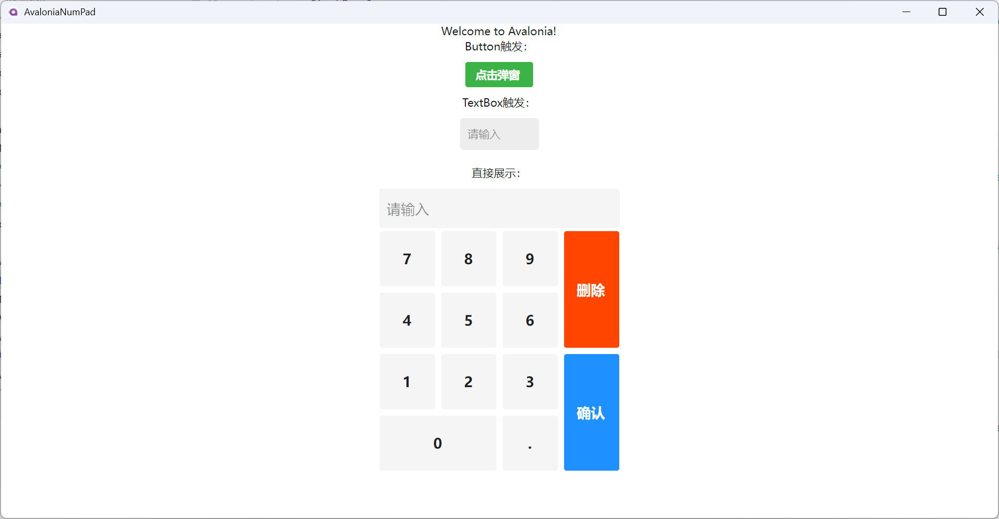

### 起因
- [Ursa.Avalonia](https://github.com/irihitech/Ursa.Avalonia)中的`NumPad`组件比较复杂，而个人只想一个带小数点的数字键盘，所以参考写了个简化版本的组件，供参考。
- 可详细看这个issue：[NumPad control fails to pop up](https://github.com/irihitech/Ursa.Avalonia/issues/606)

### 使用
- `axaml`中增加`xmlxmlns:controls="clr-namespace:AvaloniaNumPad.Controls"`
- 然后`<controls:NumPadControl Text="{Binding InputValue}" EnterCommand="{Binding EnterPressed}"></controls:NumPadControl>`

### 样式
- 
- 
